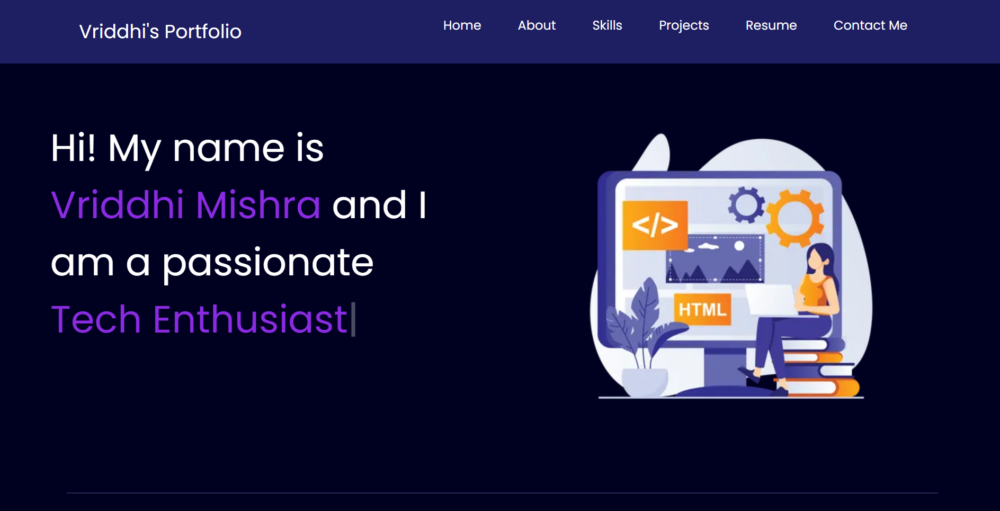

# 🌐 Personal Portfolio Website

A responsive personal portfolio website built to showcase my skills, projects, achievements, and professional journey as a Computer Science student specializing in Data Science.

## 🚀 Live Demo

🔗 [Click here to see live demo](https://vriddhimishra.github.io/Portfolio-Page/)

---

## 👩‍💻 About the Project

This portfolio serves as my personal space on the web, highlighting:

* Technical skills and technologies I work with
* Featured projects and practical experience
* Leadership and extracurricular involvement
* Resume and contact information
* Social media and professional profiles

The website is designed with a clean, modern, and responsive interface to provide a seamless experience across devices.

---

## ✨ Features

* Responsive Design
* Interactive Typing Animation
* About Me Section
* Skills Showcase
* Featured Projects
* Resume Download
* Social Media Integration
* Email Contact Button
* Mobile-Friendly Layout

---

## 🛠️ Technologies Used

### Frontend

* HTML5
* CSS3
* JavaScript
* Bootstrap 5

### Libraries & Tools

* Typed.js
* Font Awesome
* Google Fonts

### Development Tools

* VS Code
* Git
* GitHub

---

## 📂 Project Structure

```text
Portfolio-Website/
│
├── index.html
├── style.css
├── script.js
│
├── assets/
│   ├── bg.webp
│   ├── myImg.png
│   ├── spotify.png
│   ├── simon says.jpg
│   ├── PortfolioPage.png
│   ├── vm.png
│   ├── ss.png
│   └── resume_vriddhi_mishra.pdf
│
└── README.md
```

---


## 📸 Screenshots



---

## 📌 Featured Projects

### 🎵 Spotify UI Clone

A responsive music streaming interface inspired by Spotify, featuring playlists, navigation menus, and media controls.

**Tech Stack:** HTML, CSS

### 🎮 Simon Says Game

An interactive memory game that challenges users through progressively complex sequences.

**Tech Stack:** HTML, CSS, JavaScript

### 💼 Portfolio Website

A responsive personal portfolio showcasing skills, projects, leadership experience, and achievements.

**Tech Stack:** HTML, CSS, JavaScript

---

## 📄 Resume

A downloadable resume is available directly through the portfolio website.

---

## 📫 Connect With Me

* LinkedIn: [www.linkedin.com/in/vriddhi-mishra](http://www.linkedin.com/in/vriddhi-mishra)
* GitHub: [GitHub Profile](https://github.com/VriddhiMishra)
* Email: [vriddhimishra2@gmail.com](mailto:vriddhimishra2@gmail.com)

---

## ⭐ Future Improvements

* Dark/Light Theme Toggle
* React-based Portfolio Version
* Project Filtering System
* Contact Form with Backend Integration
* Blog Section

---

### Made with ❤️ by Vriddhi Mishra
